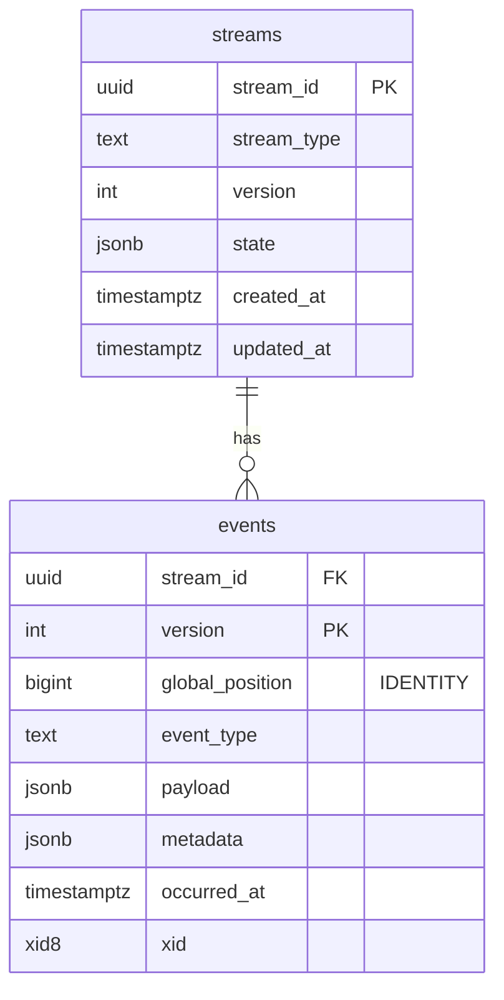
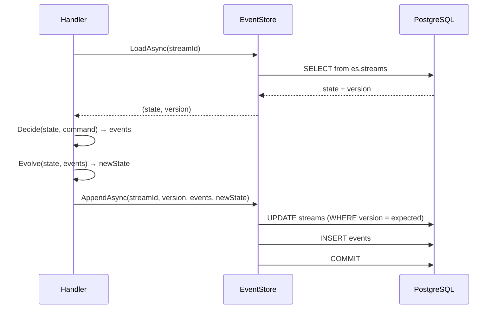
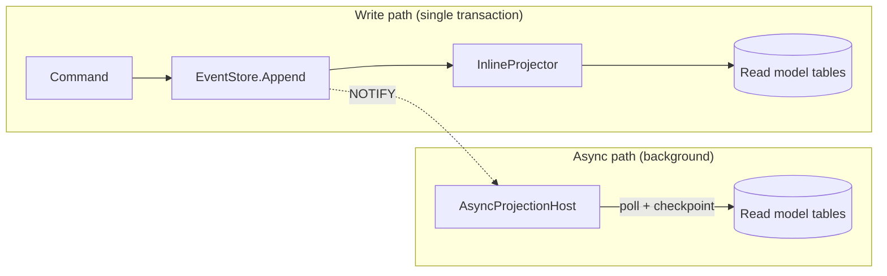
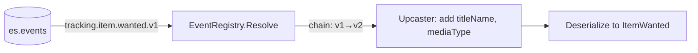

# Anthology

Self-hostable, event-sourced social media tracker. Films first, then TV, books, games, music.

Also a pragmatic DDD reference codebase in .NET — real product, minimal abstraction.

## Stack

- .NET 10 / C# / EF Core 10
- PostgreSQL 17
- React SPA (Vite)
- Single deployable modular monolith

## Quick start

```bash
docker compose up -d
dotnet run --project src/Anthology
```

App runs at `https://localhost:5001` (or the port shown in console output). Postgres on `localhost:5433`.

## Tests

```bash
dotnet test
```

Tests use Testcontainers — Docker must be running. No manual database setup needed.

## Project structure

```
src/Anthology/
  Program.cs              # composition root
  Kernel/                 # event store, messaging, Result, validation
  Modules/
    Tracking/             # core domain (event-sourced) — track/rate items, diary, library
    Catalog/              # TMDB integration + local title data
    Identity/             # ASP.NET Core Identity (cookie auth)
    Profile/              # user profile (handle, display name, bio)
  Workers/                # background services
  ClientApp/              # React SPA
tests/Anthology.Tests/    # aggregate, integration, convention, endpoint tests
```

## Architecture

- **Event sourcing** for the tracking domain. Aggregates use decide/evolve with pure functions.
- **Vertical slices** — each feature is one file containing command/query, validator, handler, and endpoint.
- **DbContext-per-module** with separate Postgres schemas (`es`, `tracking`, `catalog`, `identity`, `profile`).
- **No mediator, no generic repository, no AutoMapper.** Scrutor decorates a single transaction decorator around command handlers.

## Event sourcing decisions

### Streams: snapshot-based loading

Every aggregate gets a row in `es.streams` that holds the current state as a JSONB snapshot alongside the version number. Loading an aggregate reads one row instead of replaying the full event history.



On write, `Decide` validates the command against current state and returns events. `Evolve` folds them into new state. Both the events and the new snapshot are written atomically with an optimistic concurrency check on the version.



Stream IDs are deterministic — UUIDv5 from `userId + titleId` — so no lookup table is needed.

### Projections: inline and async

Projections transform events into read-optimised tables. Two strategies, chosen per projection:



**Inline projections** run in the same transaction as the event append. The `TransactionDecorator` commits events, projections, and outbox writes atomically. Diary and library projections are inline — the user sees updated data immediately after a command succeeds.

**Async projections** run in a background service. Each projection tracks its position via a `checkpoints` row. The host uses `SELECT ... FOR UPDATE SKIP LOCKED` for leader election and a `xid` guard (`pg_snapshot_xmin`) to avoid reading uncommitted events. A `NOTIFY new_events` signal wakes the host after each commit.

Both projection types implement the same `IProjection` interface — the difference is only in when and how they're invoked.

### Upcasting: schema evolution without migration

Events are immutable once stored. When the schema of an event type changes, an upcaster transforms the old JSON shape into the new one at read time.



Registration is declarative:

```csharp
registry.Map<ItemWanted>("tracking.item.wanted", currentVersion: 2, upcasters:
[
    Upcaster.From(1, json =>
    {
        json["titleName"] ??= "Unknown";
        json["mediaType"] ??= "film";
    })
]);
```

The event type name is versioned (`tracking.item.wanted.v2`). When the serializer reads a v1 event, the registry returns a chain of upcasters to apply in order. The transform mutates the `JsonNode` in place, then the result is deserialized into the current CLR type. No data migration, no downtime, old events stay untouched.

### Putting it together: a filterable, sortable, paginated list

The library endpoint (`GET /api/tracking/library`) demonstrates how these pieces compose into a typical API. The read model is a flat `library_items` table maintained by an inline projection — no joins, no event replay at query time.


The handler applies filters (`media`, `status`, `minRating`), dynamic sort (`added`, `rating`, `title`, `finished`), and keyset pagination — all as composable LINQ expressions against the read model:

```
GET /api/tracking/library?status=finished&sort=rating&dir=desc&size=20

→ WHERE user_id = :uid AND status = 'finished'
  ORDER BY rating DESC, title_id DESC
  -- cursor seek: AND (rating < :r OR (rating = :r AND title_id < :tid))
  LIMIT 21
```

The cursor encodes the sort value + a `title_id` tiebreaker as base64. The query fetches `size + 1` rows to detect whether a next page exists without a separate count query.

## Status

| Milestone | Scope | Status |
|-----------|-------|--------|
| **M1** | Personal spine — ES loop end to end (film tracking, diary, library, auth, React UI) | Done |
| **M2** | Lists — second aggregate (create, reorder, visibility) | Done |
| **M3** | TV catalog + episode tracking (TMDB TV endpoints, show→season→episode hierarchy, show-progress projection) | Done |
| **M4** | Async projections — gap-safe ordering, LISTEN/NOTIFY wake-up, checkpointing | Done |
| **M5** | Social platform — profiles, follows, fan-out-on-write feed, visibility, retraction | Next |
