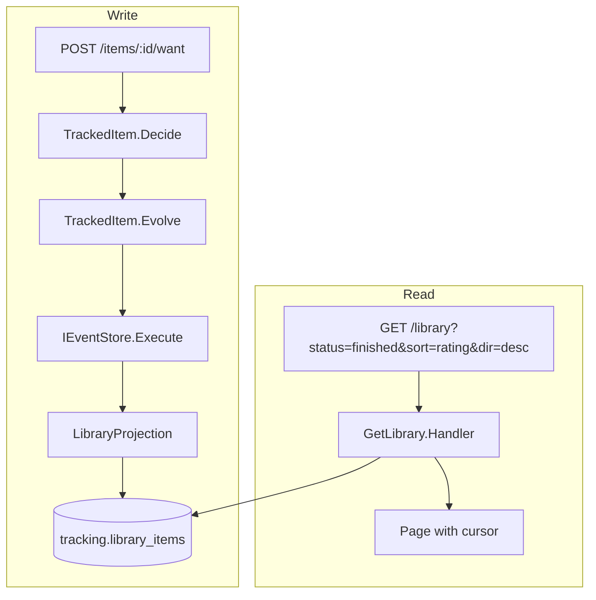

# Anthology

Self-hostable, event-sourced social media tracker. Films first, then TV, books, games, music.

Also a pragmatic DDD reference codebase in .NET — real product, minimal abstraction.

## Stack

- .NET 10 / C# / EF Core 10
- PostgreSQL 17
- React SPA (Vite)
- Single deployable modular monolith

## Quick start

```bash
docker compose up -d
dotnet run --project src/Anthology
```

App runs at `https://localhost:5001` (or the port shown in console output). Postgres on `localhost:5433`.

## Tests

```bash
dotnet test
```

Tests use Testcontainers — Docker must be running. No manual database setup needed.

## Project structure

```
src/Anthology/
  Program.cs              # composition root
  Kernel/                 # Result, errors, command interfaces, validation
  Modules/
    Tracking/             # core domain (event-sourced) — track/rate items, diary, library
    Catalog/              # TMDB integration + local title data
    Identity/             # ASP.NET Core Identity (cookie auth)
    Profile/              # user profile (handle, display name, bio)
  Workers/                # background services
  ClientApp/              # React SPA
tests/Anthology.Tests/    # aggregate, integration, convention, endpoint tests
```

## Architecture

- **Event sourcing** for the tracking domain, on [Deedbox](https://github.com/alternayte/deedbox). Aggregates use decide/evolve with pure functions.
- **Vertical slices** — each feature is one file containing command/query, validator, handler, and endpoint.
- **DbContext-per-module** with separate Postgres schemas (`tracking`, `catalog`, `identity`, `profile`, `recommendations`). Deedbox keeps the events in its own `deedbox` schema.
- **No mediator, no generic repository, no AutoMapper.** Scrutor decorates command handlers with one validation decorator. Deedbox owns the write transaction.

## Event sourcing decisions

### Streams and state

Deedbox stores the events of each stream in `deedbox.events` and the latest state in `deedbox.streams`. A handler calls `Execute`. It locks the stream, loads the state, runs `Decide`, appends the events and saves the new state, in one transaction:

```csharp
var result = await store
    .WithMetadata(m => TrackingMetadata.For(m, command.UserId, command.TitleId))
    .Execute<TrackedItemState>(streamId, state => Decide(state, command), ct);
```

`Decide` returns a `Result`. The kernel helper `Decisions.Execute` turns an error into "append nothing and return the error".

Stream IDs are deterministic — UUIDv5 from `userId + titleId` with `StreamId.Deterministic` — so no lookup table is needed.

### Projections

The diary, library and lists read models are `Projection<TrackingDbContext>` classes, with one `On<TEvent>` handler per event type:

```csharp
On<ItemStarted>((e, ctx) => Insert(ctx, TrackingMetadata.TitleId(ctx.Metadata), TrackedStatus.InProgress, null, e.At));
```

All three run inline, in the transaction of the append, so the user sees the change when the command returns. Each projection has a stored name (`diary`, `library`, `lists`) and one run mode. The admin API rebuilds a projection: Deedbox calls its `ResetAsync`, then replays every event through it in the background.

The events do not hold the user, and most tracked-item events do not hold the title. The handlers put both in metadata headers, and the projections read them with `TrackingMetadata`.

### Upcasting and names

The stored names predate Deedbox, so each stream and event name is explicit in `TrackingModule`. `ItemWanted` is at version 2. Deedbox upcasts version 1 events when it reads them:

```csharp
.Event<ItemWanted>(2, e => e
    .Name("tracking.item.wanted")
    .From(1, json =>
    {
        json["titleName"] ??= "Unknown";
        json["mediaType"] ??= "film";
    }))
```

Earlier builds stored new ratings as `tracking.item.rerated`. The alias keeps those events readable, and new ratings are stored as `tracking.item.rated`.

### Moving from the hand-written event store

Anthology had its own event store in schema `es` before Deedbox. `scripts/migrate-es-to-deedbox.sql` moves that data into Deedbox once. The script header gives the order of steps. The tests run on a database that the script migrated from `tests/Anthology.Tests/Fixtures/legacy-es.sql`, which the old event store wrote.

### Putting it together: a filterable, sortable, paginated list

The library endpoint (`GET /api/tracking/library`) demonstrates how these pieces compose into a typical API. The read model is a flat `library_items` table maintained by an inline projection — no joins, no event replay at query time.



The handler applies filters (`media`, `status`, `minRating`), dynamic sort (`added`, `rating`, `title`, `finished`), and keyset pagination — all as composable LINQ expressions against the read model:

```
GET /api/tracking/library?status=finished&sort=rating&dir=desc&size=20

→ WHERE user_id = :uid AND status = 'finished'
  ORDER BY rating DESC, title_id DESC
  -- cursor seek: AND (rating < :r OR (rating = :r AND title_id < :tid))
  LIMIT 21
```

The cursor encodes the sort value + a `title_id` tiebreaker as base64. The query fetches `size + 1` rows to detect whether a next page exists without a separate count query.

## Status

| Milestone | Scope | Status |
|-----------|-------|--------|
| **M1** | Personal spine — ES loop end to end (film tracking, diary, library, auth, React UI) | Done |
| **M2** | Lists — second aggregate (create, reorder, visibility) | Done |
| **M3** | TV catalog + episode tracking (TMDB TV endpoints, show→season→episode hierarchy, show-progress projection) | Done |
| **M4** | Async projections — gap-safe ordering, LISTEN/NOTIFY wake-up, checkpointing | Done |
| **M5** | Social platform — profiles, follows, fan-out-on-write feed, visibility, retraction | Next |
